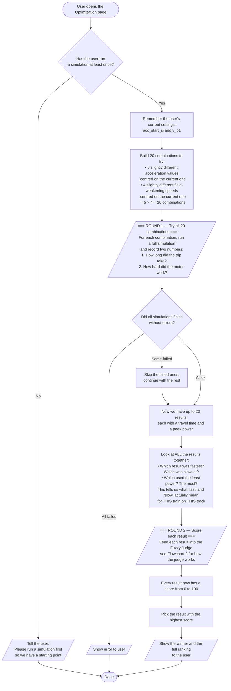
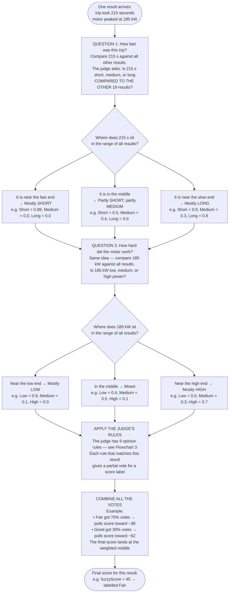
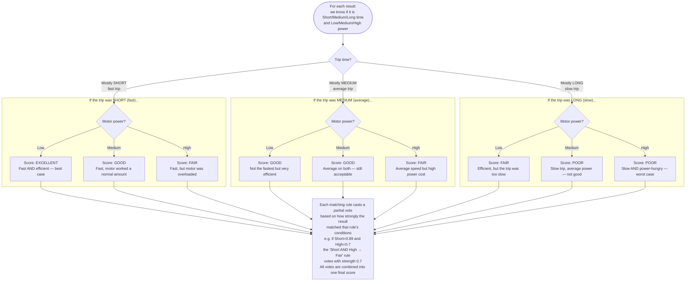
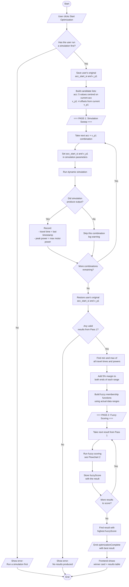
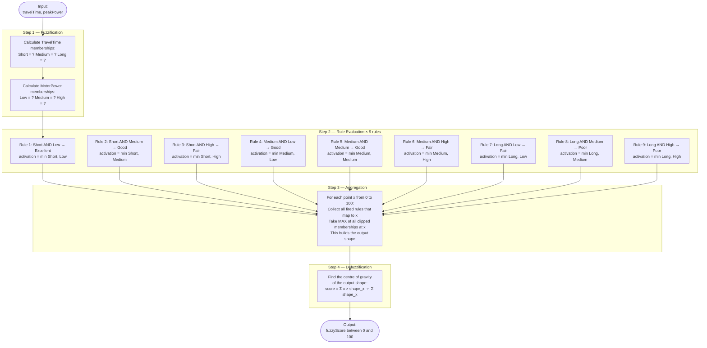

# Fuzzy Logic Optimization — Flowcharts (Plain Language)

---

## Flowchart 1 — The Big Picture: How the Optimizer Finds the Best Setting

Think of this like a cooking competition. The chef (optimizer) tries 20 different recipes (parameter combinations), then a judge (fuzzy engine) scores each dish and picks the winner.

---

## Flowchart 2 — The Fuzzy Judge: How One Result Gets a Score

Imagine a judge at a train performance competition. They look at two things: **was the trip fast?** and **was the motor not overworked?** They don't give binary pass/fail — they give partial credit, like a human would.

---

## Flowchart 3 — The Judge's 9 Opinion Rules

This is the human knowledge baked into the system. A human engineer wrote these rules once. The engine applies them to every result automatically.

---

## How to View These Diagrams

### Option 1 — VS Code (recommended, free)

1. Press `Ctrl+Shift+X`
2. Search **Markdown Preview Mermaid Support** (by Matt Bierner) → Install
3. Open this file → press `Ctrl+Shift+V`
4. The flowcharts render live inside the preview panel

### Option 2 — Online (best for exporting to PNG/PDF for your thesis)

1. Go to **https://mermaid.live**
2. Copy the code between the triple backticks of any flowchart
3. Paste it into the left panel — the diagram appears on the right
4. Click **Export** → PNG or SVG

### Option 3 — GitHub

Push this file and open it on GitHub. Mermaid renders automatically — no tools needed.

---

## Flowchart 2 — Fuzzy Scoring (one result)

This runs once per result in Pass 2. Input: one `(travelTime, peakPower)` pair.

---

---

## How to View These Diagrams

### Option 1 — VS Code (recommended)

Install the extension **"Markdown Preview Mermaid Support"** by Matt Bierner:

- Press `Ctrl+Shift+X` → search `Markdown Preview Mermaid Support` → Install
- Open this file → press `Ctrl+Shift+V` to open the Markdown preview
- The flowcharts render automatically inside the preview

### Option 2 — GitHub

Push this file to your repository. GitHub renders Mermaid diagrams natively inside Markdown files — no extension needed.

### Option 3 — Online

Copy any code block (the text between the triple backticks) and paste it into **https://mermaid.live** — it renders and you can export as PNG or SVG for your thesis.
