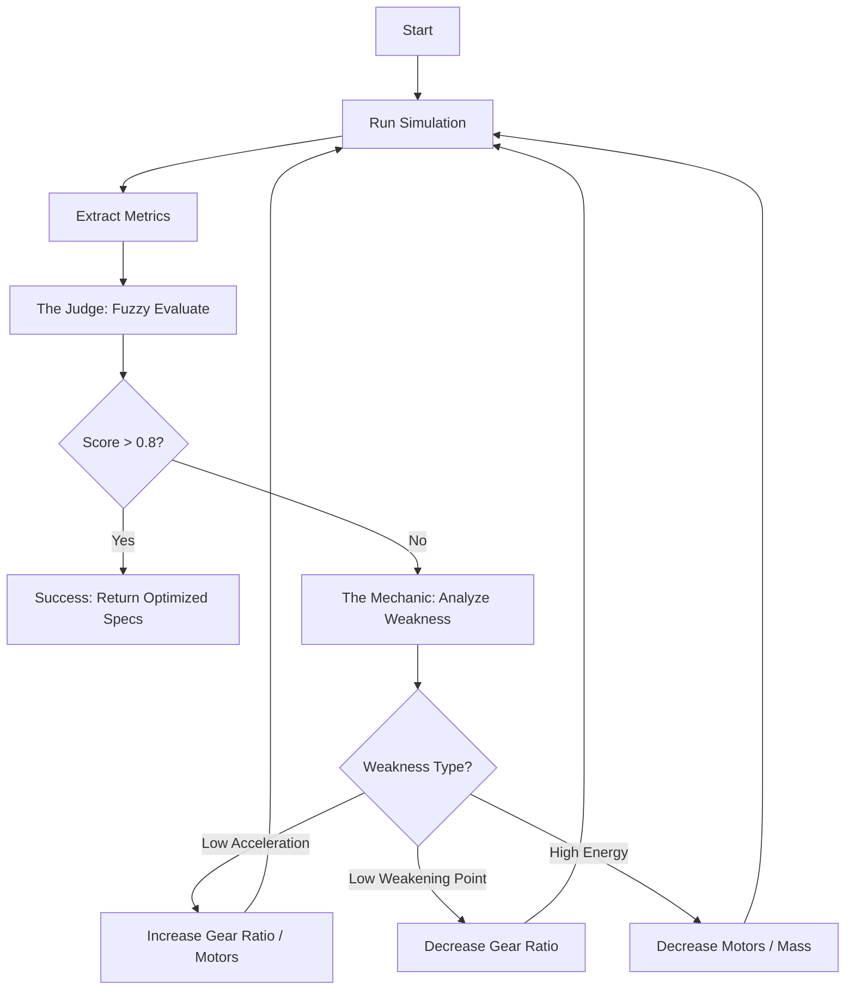

# Fuzzy Logic Optimization Strategy

## 1. Overview
This document outlines the strategy for implementing the **Fuzzy Logic Optimization** feature.
**Goal**: Automatically generate **Optimized Train Specifications** (e.g., Number of Motors, Gear Ratio) that best fit a specific track.

## 2. The "Mechanic & Judge" Architecture

To turn the Thesis's *Evaluation* logic into an *Optimization* system, we use a two-part architecture:

1.  **The Judge (Fuzzy Engine)**:
    *   **Source**: Directly from Thesis Section 3.2.3.
    *   **Role**: Evaluates the current performance.
    *   **Input**: Simulation Results (Acceleration, Weakening Point, etc.).
    *   **Output**: Suitability Score (0.0 - 1.0).

2.  **The Mechanic (Optimization Handler)**:
    *   **Source**: New Logic (The "Better Plan").
    *   **Role**: Tweak the train specs to satisfy The Judge.
    *   **Logic**: It looks at *why* the score is low and applies specific fixes.

### Data Flow

## 3. Detailed Logic

### 3.1 The Judge (Fuzzy Engine)
Implemented exactly as per Thesis.
*   **Inputs**: `Acceleration`, `Weakening Point`, `Gradient`, `Speed Limit`.
*   **Rules**: Mamdani Inference (e.g., "IF Acc Low THEN Suitability Low").
*   **Output**: `Suitability` (0.0 - 1.0).

### 3.2 The Mechanic (Heuristic Optimizer)
Instead of random guessing, we map **Performance Deficits** to **Spec Adjustments**.

| Deficit (From Simulation) | Action (Train Parameter Adjustment) |
| :--- | :--- |
| **Acceleration is LOW** | Increase `Gear Ratio` OR Increase `Number of Motors` |
| **Weakening Point is LOW** | Decrease `Gear Ratio` |
| **Max Speed is LOW** | Decrease `Gear Ratio` OR Increase `Wheel Diameter` |
| **Energy Consumption is HIGH** | Decrease `Number of Motors` OR Decrease `Mass` |

**The Optimization Loop:**
1.  **Simulate**.
2.  **Fuzzify Inputs**: Check which membership is highest (e.g., is Acceleration "Low"?).
3.  **Calculate Suitability**: Get the score.
4.  **Decide Action**:
    *   If `Suitability` is good, Stop.
    *   If `Acceleration` is "Low", apply `Action: Increase Gear Ratio`.
    *   If `Weakening Point` is "Low", apply `Action: Decrease Gear Ratio`.
    *   *Conflict Resolution*: If actions conflict (e.g., need more Acc but also more WP), prioritize based on which membership is "Lower" or use a balanced step.
5.  **Apply Mutation**: Update `TrainData`.
6.  **Repeat**.

## 4. Implementation Steps

### Step 1: Backend Model (`FuzzyEngine`)
*   Implement the Thesis Logic (Membership Functions + Rules).
*   **Crucial Addition**: Add a method `getDominantMembership(value)` to return whether a value is "Low", "Medium", or "High". The Mechanic needs this to know *what* to fix.

### Step 2: Backend Controller (`OptimizationHandler`)
*   Implement the Loop.
*   Implement `adjustSpecs(TrainData& data, DeficitType deficit)`.
    *   e.g., `data.gear_ratio += 0.1;`

### Step 3: Frontend
*   Display the **Evolution**: Show how the specs changed from Start -> Finish.
*   Display the **Reasoning**: "Increased Gear Ratio because Acceleration was Low."

## 5. Verification
*   **Scenario**: Run with a heavy train (Low Acc).
*   **Expectation**: System should iteratively increase `n_tm` or `gear_ratio` until the Fuzzy Score improves.
